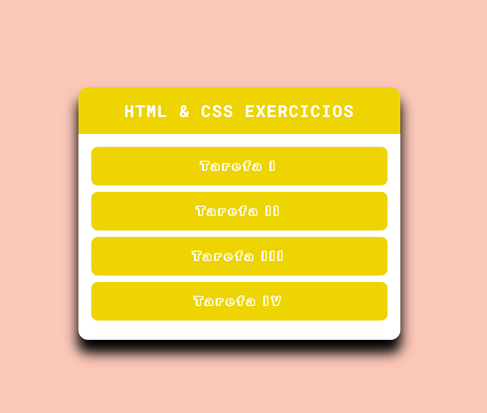

# DevQuest - HTML & CSS ⭐
## Quest - Página de exercícios módulos avançados
### [Deploy]()

# Desafio: Centralizar todos o sexercicios propóstos
## Objetivos:
* Crie um Card para um perfil de usuário, utilize frontendMentor.
* Crie uma página geradora de conselhos, utilize frontendMentor
* Faça um menu de navegação utlizando o conceito de FlexBox.
* Crie alguns cards contendo imagens com titulos e descrição, utilize conceito de flexBox.

## Maior dificuldade:
* Aplicar o flexbox

## O que aprendi?
* Com estes desafios, aprendi a importância do uso de flexbox e também consigo  identificar quando utiliza-lo e quando usar os grid's.

### Screenshots
* Desktop
** 

# Author
### Josué Ocanha Costa
#### FrontEnd Developer
#### Redes Sociais

# "Vida longa e próspera. 🖖🖖🖖"